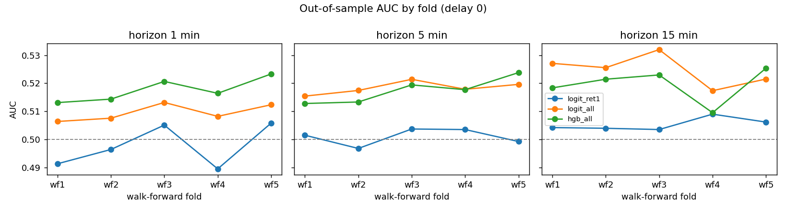
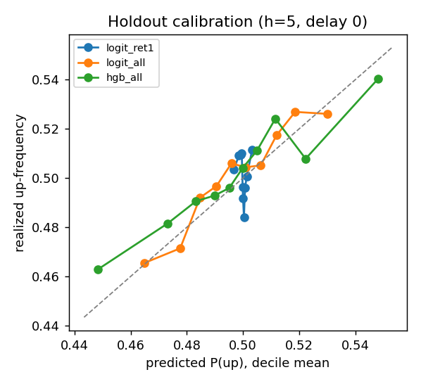
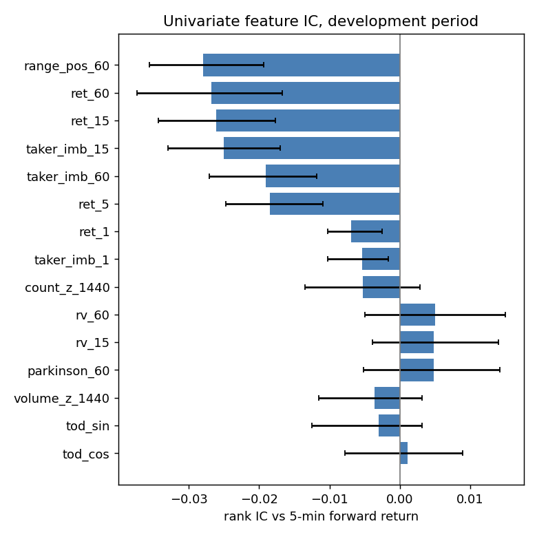

# Results: BTCUSDT 1m, 2024-07 to 2025-06

_Generated 2026-10-01 16:16 UTC by `python -m qsr.report` (commit `005e2af137ff2f4dc25fff52997522c50d767141`). Nothing in this file is hand-edited._

## Verdict

**Primary configuration** (`logit_all`, 5-minute horizon, delay 1): AUC 0.521 [0.512, 0.529], gross edge 0.15 bps [-0.03, 0.33] vs 40 bps round-trip fee -> **detectable, below cost hurdle**.

Of 18 model/horizon/delay configurations: 0 detectable, above cost hurdle; 15 detectable, below cost hurdle; 3 no detectable signal.

A configuration is **detectable** only if its holdout AUC interval excludes 0.5 at the Bonferroni-adjusted level 0.9972 (18 configurations tested, family-wise alpha 0.05). It is **above the cost hurdle** only if, in addition, the lower bound of gross edge per prediction exceeds the assumed round-trip cost of 40.0 bps (20.0 bps per side). Edge is a hurdle check, not a backtest; see docs/METHODOLOGY.md.

## Data

| item | value |
|---|---|
| bars loaded | 525,600 |
| span (UTC) | 2024-07-01 00:00:00+00:00 to 2025-06-30 23:59:00+00:00 |
| missing bars | 0 (0.0%) |
| duplicate bars dropped | 0 |
| zero-volume bars | 0 |
| OHLC violations | 0 |
| taker volume > volume | 0 |
| archives (sha256 verified) | 12 |

Largest gaps (start, missing bars): none

## Holdout (evaluated once)

Holdout period: 2025-04-19 04:47:00+00:00 to 2025-06-30 23:58:00+00:00. Intervals: 0.9972 moving-block bootstrap, 300 resamples.

| model | h | delay | AUC [CI] | acc / majority | LL skill | rank IC [CI] | edge bps [CI] | verdict |
|---|---|---|---|---|---|---|---|---|
| base_rate | 1 | 0 | 0.500 [0.500, 0.500] | 0.499 / 0.501 | 0.0000 | n/a [n/a, n/a] | -0.02 [-0.06, 0.02] | baseline |
| logit_ret1 | 1 | 0 | 0.493 [0.489, 0.499] | 0.496 / 0.501 | -0.0000 | -0.012 [-0.021, -0.003] | -0.08 [-0.12, -0.05] | no detectable signal |
| logit_all | 1 | 0 | 0.519 [0.514, 0.525] | 0.514 / 0.501 | 0.0008 | 0.032 [0.024, 0.041] | 0.08 [0.04, 0.12] | detectable, below cost hurdle |
| hgb_all | 1 | 0 | 0.530 [0.524, 0.535] | 0.518 / 0.501 | 0.0023 | 0.044 [0.035, 0.051] | 0.09 [0.05, 0.13] | detectable, below cost hurdle |
| base_rate | 1 | 1 | 0.500 [0.500, 0.500] | 0.499 / 0.501 | 0.0000 | n/a [n/a, n/a] | -0.02 [-0.06, 0.02] | baseline |
| logit_ret1 | 1 | 1 | 0.506 [0.502, 0.511] | 0.504 / 0.501 | 0.0000 | 0.013 [0.006, 0.022] | 0.03 [-0.01, 0.07] | detectable, below cost hurdle |
| logit_all | 1 | 1 | 0.511 [0.505, 0.516] | 0.508 / 0.501 | 0.0002 | 0.022 [0.012, 0.028] | 0.04 [-0.01, 0.08] | detectable, below cost hurdle |
| hgb_all | 1 | 1 | 0.506 [0.501, 0.510] | 0.504 / 0.501 | -0.0002 | 0.011 [0.002, 0.019] | 0.01 [-0.03, 0.05] | detectable, below cost hurdle |
| base_rate | 5 | 0 | 0.500 [0.500, 0.500] | 0.499 / 0.501 | 0.0000 | n/a [n/a, n/a] | -0.11 [-0.30, 0.08] | baseline |
| logit_ret1 | 5 | 0 | 0.498 [0.493, 0.502] | 0.497 / 0.501 | 0.0000 | -0.000 [-0.008, 0.007] | -0.08 [-0.17, 0.02] | no detectable signal |
| logit_all | 5 | 0 | 0.522 [0.512, 0.531] | 0.514 / 0.501 | 0.0010 | 0.043 [0.025, 0.062] | 0.16 [-0.03, 0.33] | detectable, below cost hurdle |
| hgb_all | 5 | 0 | 0.522 [0.514, 0.530] | 0.516 / 0.501 | 0.0008 | 0.039 [0.024, 0.052] | 0.18 [0.03, 0.34] | detectable, below cost hurdle |
| base_rate | 5 | 1 | 0.500 [0.500, 0.500] | 0.499 / 0.501 | 0.0000 | n/a [n/a, n/a] | -0.11 [-0.32, 0.11] | baseline |
| logit_ret1 | 5 | 1 | 0.502 [0.498, 0.507] | 0.502 / 0.501 | 0.0000 | 0.011 [0.002, 0.019] | 0.06 [-0.03, 0.15] | no detectable signal |
| logit_all | 5 | 1 | 0.521 [0.512, 0.529] | 0.513 / 0.501 | 0.0009 | 0.040 [0.025, 0.056] | 0.15 [-0.03, 0.33] | detectable, below cost hurdle |
| hgb_all | 5 | 1 | 0.518 [0.510, 0.526] | 0.512 / 0.501 | 0.0003 | 0.037 [0.020, 0.052] | 0.16 [-0.03, 0.34] | detectable, below cost hurdle |
| base_rate | 15 | 0 | 0.500 [0.500, 0.500] | 0.503 / 0.503 | 0.0000 | n/a [n/a, n/a] | 0.33 [-0.24, 0.89] | baseline |
| logit_ret1 | 15 | 0 | 0.505 [0.501, 0.510] | 0.506 / 0.503 | 0.0001 | 0.009 [0.001, 0.018] | 0.25 [-0.11, 0.59] | detectable, below cost hurdle |
| logit_all | 15 | 0 | 0.531 [0.518, 0.544] | 0.522 / 0.503 | 0.0021 | 0.054 [0.025, 0.080] | 0.43 [-0.09, 0.86] | detectable, below cost hurdle |
| hgb_all | 15 | 0 | 0.526 [0.514, 0.537] | 0.519 / 0.503 | 0.0008 | 0.046 [0.020, 0.067] | 0.39 [-0.11, 0.75] | detectable, below cost hurdle |
| base_rate | 15 | 1 | 0.500 [0.500, 0.500] | 0.503 / 0.503 | 0.0000 | n/a [n/a, n/a] | 0.33 [-0.25, 0.80] | baseline |
| logit_ret1 | 15 | 1 | 0.507 [0.503, 0.511] | 0.505 / 0.503 | 0.0001 | 0.013 [0.004, 0.021] | 0.28 [-0.05, 0.59] | detectable, below cost hurdle |
| logit_all | 15 | 1 | 0.530 [0.518, 0.543] | 0.521 / 0.503 | 0.0019 | 0.052 [0.029, 0.078] | 0.46 [0.02, 0.94] | detectable, below cost hurdle |
| hgb_all | 15 | 1 | 0.523 [0.511, 0.534] | 0.516 / 0.503 | 0.0003 | 0.041 [0.017, 0.066] | 0.39 [-0.08, 0.85] | detectable, below cost hurdle |

## Walk-forward stability (development period)

| model | h | delay | AUC mean | AUC sd | AUC worst fold | edge bps mean |
|---|---|---|---|---|---|---|
| base_rate | 1 | 0 | 0.500 | 0.000 | 0.500 | -0.01 |
| logit_ret1 | 1 | 0 | 0.498 | 0.008 | 0.489 | -0.04 |
| logit_all | 1 | 0 | 0.510 | 0.003 | 0.506 | 0.03 |
| hgb_all | 1 | 0 | 0.518 | 0.004 | 0.513 | 0.06 |
| base_rate | 1 | 1 | 0.500 | 0.000 | 0.500 | -0.01 |
| logit_ret1 | 1 | 1 | 0.504 | 0.005 | 0.496 | 0.02 |
| logit_all | 1 | 1 | 0.507 | 0.002 | 0.504 | 0.02 |
| hgb_all | 1 | 1 | 0.507 | 0.002 | 0.504 | 0.03 |
| base_rate | 5 | 0 | 0.500 | 0.000 | 0.500 | 0.04 |
| logit_ret1 | 5 | 0 | 0.501 | 0.003 | 0.497 | 0.02 |
| logit_all | 5 | 0 | 0.518 | 0.002 | 0.515 | 0.12 |
| hgb_all | 5 | 0 | 0.517 | 0.005 | 0.513 | 0.10 |
| base_rate | 5 | 1 | 0.500 | 0.000 | 0.500 | 0.04 |
| logit_ret1 | 5 | 1 | 0.504 | 0.005 | 0.499 | 0.09 |
| logit_all | 5 | 1 | 0.518 | 0.002 | 0.515 | 0.11 |
| hgb_all | 5 | 1 | 0.516 | 0.004 | 0.509 | 0.07 |
| base_rate | 15 | 0 | 0.500 | 0.000 | 0.500 | 0.13 |
| logit_ret1 | 15 | 0 | 0.505 | 0.002 | 0.503 | 0.04 |
| logit_all | 15 | 0 | 0.525 | 0.006 | 0.517 | 0.25 |
| hgb_all | 15 | 0 | 0.520 | 0.006 | 0.509 | 0.16 |
| base_rate | 15 | 1 | 0.500 | 0.000 | 0.500 | 0.13 |
| logit_ret1 | 15 | 1 | 0.506 | 0.002 | 0.503 | 0.08 |
| logit_all | 15 | 1 | 0.524 | 0.006 | 0.517 | 0.26 |
| hgb_all | 15 | 1 | 0.519 | 0.006 | 0.510 | 0.17 |

## Univariate feature IC (development period, h=5, delay 0)

Intervals at the Bonferroni level for 15 features. Diagnostic only: no model or feature choice was made from this table.

| feature | rank IC | CI |
|---|---|---|
| range_pos_60 | -0.0280 | [-0.0356, -0.0194] |
| ret_60 | -0.0268 | [-0.0373, -0.0167] |
| ret_15 | -0.0261 | [-0.0343, -0.0177] |
| taker_imb_15 | -0.0250 | [-0.0330, -0.0170] |
| taker_imb_60 | -0.0191 | [-0.0271, -0.0118] |
| ret_5 | -0.0184 | [-0.0247, -0.0110] |
| ret_1 | -0.0069 | [-0.0103, -0.0026] |
| taker_imb_1 | -0.0054 | [-0.0102, -0.0017] |
| count_z_1440 | -0.0053 | [-0.0135, 0.0029] |
| rv_60 | 0.0050 | [-0.0050, 0.0150] |
| rv_15 | 0.0048 | [-0.0039, 0.0140] |
| parkinson_60 | 0.0048 | [-0.0052, 0.0142] |
| volume_z_1440 | -0.0036 | [-0.0115, 0.0032] |
| tod_sin | -0.0031 | [-0.0125, 0.0031] |
| tod_cos | 0.0011 | [-0.0078, 0.0089] |

## Figures





## Reproduce

```
make data START=2024-07 END=2025-06
make report
```

Input archive digests and package versions are in `run_manifest.json`.
